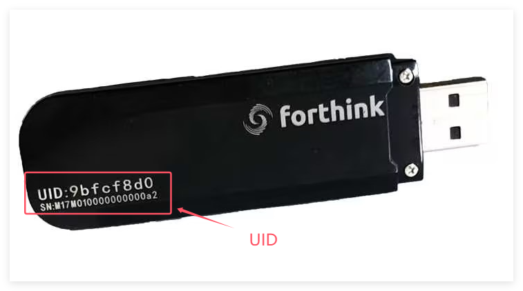

# python-uwbzero

## 1. Introduction
A beginner-friendly python library for uwb ranging and positioning, supports CCC and FiRa protocol.

Supported Hardware: [Forthink UWB-Dongle](https://item.taobao.com/item.htm?id=858072852508)

### 1.1 Architecture

- Hardware: UWB Chips Support IEEE 802.15.4z, e.g. NCJ29D5, SR150, DW3000, etc. 
- The [Forthink UWB-Dongle](https://item.taobao.com/item.htm?id=858072852508) support NXP MAC(default), [Forthink-CCC-MAC](https://github.com/forthink-xyz/forthink_ccc_mac).

- UWB MAC: support FiRa, CCC, etc, running on devices, not in the library. 

- Hardware Interface：FiRa UCI (UWB Command Interface) Generic，communication interface, include in this library.

- Middleware：UCI, FiRa, CCC and NearbyInteraction interfaces, include in this library.

- Application：based on UWB MAC，for ranging, positioning and data transfer(CCC Expand), Reverse-TDOA (comming soon).


## 2. Example Apps

Example apps in the app floders.

### 2.1 ccc_ranging
The CCC Ranging example shows how to use the CCC library to start a CCC session, and read the distance from the Responder.

In the 5 Responders example, we can see how the CCC digital key system works. The responder's slot index in CCC Session from 0 to N-1 ( N is the responder number).

 - 1_uwbmac_ccc_car_keys_*, the exapmle working with the [Car Keys Tests app](https://apps.apple.com/app/car-keys-tests/id1635860023), support iPhone and iWatch. 
    *Notice: the iPhone app only for MFi licensees only. *
    **iPhone CCC Session Parameters:**  


    | Parameters | Unmodifiable Value | Configurable default values |
    |  --- | ----------               | --- |
    | UWB Session ID      | 0x87654321                    | |
    | URSK                | 0x000102030405060708090a0b0c0d0e0f101112131415161718191a1b1c1d1e1f ||
    | STS Index           | 0x12345678                    ||
    | Protocol Version    |                         | 0x0100 |
    | UWB Config ID       | 1                             | 1 |
    | Channel             | 9                             | 9 |
    | Sync Code           | 9                             | 9 |
    | Chaps per slot      | 6                             | 6 |
    | Hop Mode Config | | 0x80 (no hop) |

 - 2_uwbmac_ccc_ranging_initiator/responder, the default CCC ranging Test Vector (Car Connectivity Consortium Digital Key Release 3 Technical Specification, CCC-TS-101).

    | Parameters | values |
    | --- | --- |
    | Session ID | 0x12345678 |
    | URSK | 0xed07a80d2beb00f785af2627c96ae7c118504243cb2c3226b3679daa0f7e616c |
    | STS Index | 0x075BCD15 |
    | UWB Config ID | 0 |
    | UWB Protocol Version | 0x0100 |
    | Session RAN Multiplier | 0x0A |
    | Slot Per Round | 6 |
    | Chaps Per Slot | 6 |
    | PulseShape Combo | 0 |
    | Hop Mode Key | 0x4C5772BC90798c8e518d2449092f1b56 |

 - 3_uwbmac_ccc_ranging_***_exp_data, the expanded CCC protocol, support the Data Broadcast, from the initiator to the responders, to run the example, the UWB-Dongle needs to run the Forthink-CCC-MAC firmware.


### 2.2 fira_ranging
The FiRa Ranging Example shows how to use the FiRa library to start a fira session, and show the distance between the UWB devices.

The `FiRaSessionParam` needs set the device address. For the initiator, set the responders address throuth the `set_dst_addresses`; for the responder, the destination address is just the initiator's address.

The responder's slot index in FiRa begin from 1 to N (responder number).

The examples shows 1 initiator with two responder applicaton.


### 2.3 iOS Nearby Interface

This example shows how to communation with the iPhone use the BLE, and UWB ranging with iPhone.
The example runs on the raspberry, which BLE communication with the iPhone. Not support now, coming soon.


## 3. drivers

The hardware driver interface to operate the UWB hardware. The UWB Dongle use the FT4222h to support the 6-wire SPI FiRa-UCI.

## 4. middleware

### 4.1 CCC

- `CCCRangingDevice.py`, support `CCCRangingDevice` and `CCCSessionParam` for the CCC 3.0 application.
- `CCCRegionParams.py`, the CCC Session params in Enum.

### 4.2 FiRa

- `FiRaRangingDevice.py`, support `FiRaRangingDevice` and `FiRaSessionParam` for the FiRa application.
- `FiRaRegionParams.py`, the FiRa Session params in Enum.

### 4.3 NI

Forthink NearbyInteraction library in python, to support Apple Nearby Interaction.

### 4.4 UCI

The UCI Layer, to support FiRa-UCI Generic interface, support the FiRa-UCI Generic protocol.

## 5. How to use the Library 

*Recommend using the Visual Studio Code for debugging and developing.*

### 5.1 Install the dependencies

Install the python libraries:

`python -m pip install -r requirements.txt`

if install slow, use the tsinghua source:

`pip install -r requirements.txt -i https://pypi.tuna.tsinghua.edu.cn/simple/`

The Python version : Python 3.11.3

### 5.2 set the PYTHONPATH in .env

In our application, the drivers and middleware libraries already added to the `.env` file, which can be well supported by the Visual Studio Code default configuration.

### 5.3 run the apps

Go to the `apps/`, run the application script, in the current application scripts, they all appear in pairs, one initiator and one for responder.

## 6. Q&A

### 1. How to get the UID and LICENSE

Step 1: Get the UID from the product, for example: `9bfcf8d0`.


Step 2: Get the LICENSE from the Forthink website [https://licenses.forthink.com.cn/](https://licenses.forthink.com.cn/).

Step 3: Change the UID and LICENSE in the .py app file.

```python
DONGLE_UID = "d05efb9e"  # your UID
# LICENSE Get from the website
DONGLE_LICENSE = "7967f9ef4eb14809123fd3c43a30e4b606208a3a960b35d9281fc09b089389300c72ee360695164646c8728c2c3da03663acb0c0bf0ea08dfcc1187fff6d59f7"
```

## 7. Release log

### (2024.11.28-v0.1.0)
- **Features**:
  - First version of the `python-uwbzero`, currently only support the Forthink UWB Dongle Hardware.
  - Support the Normal CCC 3.0 UWB MAC.
  - Support the FiRa MAC v1.3.0.
  - Support the [Forthink-CCC-MAC V1.0.0](https://github.com/forthink-xyz/forthink_ccc_mac).
- **Fixed**:
  - None
- **Known issue**:
  - The Dongle with the Normal UWB MAC run the ***_exp_data script will fail. Only the Forthink-CCC-MAC V1.0.0 support the script.


## 7. Contact us

WebSite: https://www.forthink.com.cn
License: https://licenses.forthink.com.cn/
Email: dksupports@everhigh.com.cn
Shop:  [Forthink store](https://shop224007954.taobao.com/)